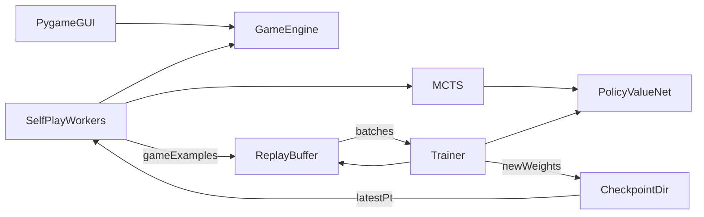

# GuuGo Architecture

This document describes the system architecture of the GuuGo project. It
complements the user-facing instructions in [`README.md`](README.md) and
is intended for anyone who needs to extend, scale, or deploy the code.

The project has two tracks:

1. A beginner 9x9 Go **PvP app** (`go_game/` + `main.py`) that satisfies
   the class assignment's test-harness interface.
2. An **AlphaZero-style training pipeline** (`alphazero/`) that reuses
   the same rules engine to teach a neural network through self-play.

Both tracks depend on the same rules engine. Nothing else is shared
between them, so the PvP app remains a small pure-Python program with a
pygame dependency, while the training stack adds PyTorch and NumPy.

---

## 1. Component overview

Three runtime components communicate exclusively through on-disk
artifacts:

| Producer             | Artifact                              | Consumer       |
| -------------------- | ------------------------------------- | -------------- |
| Self-play workers    | `replay/game_*.pkl`                   | Trainer        |
| Trainer              | `checkpoints/latest.pt` + numbered    | Self-play      |
| Trainer              | `checkpoints/latest.json` (meta)      | Self-play      |

This decoupling is the point of the design: a worker never blocks on the
trainer, the trainer never blocks on a worker, and they can live on
different processes or hosts as long as they share those directories.

---

## 2. Rules engine (shared foundation)

Everything starts from `go_game.engine.GameEngine`. It is a
dependency-free Python class that owns the full state of a 9x9 game: the
immutable board grid, whose turn it is, the previous board (for simple
ko), running capture counts, and the terminal result.

Key APIs used by the two tracks:

- Assignment harness: `play`, `is_legal`, `board_state`, `pass_turn`,
  `finish_by_score`.
- Training additions (in [`go_game/engine.py`](go_game/engine.py)):
  - `clone()` returns a cheap copy (the board is already a tuple of
    tuples).
  - `iter_legal_points()` / `legal_points()` enumerate playable points.
  - `board_grid` exposes the raw immutable grid for hot-path encoders.
  - `terminal_value(color)` converts a finished game into `+1 / -1 / 0`.

The engine enforces the assignment's rules (pass = resignation, simple
ko, suicide with capture exception, Chinese area scoring with komi 2.5).
The training pipeline trains on exactly that ruleset by design.

---

## 3. PvP app (track 1)

A single entry point [`main.py`](main.py) launches the pygame UI at
[`go_game/gui.py`](go_game/gui.py). The GUI is a thin presentation layer:
it draws the board, routes clicks to `GameEngine.play`, and renders the
engine's current state. No training code is imported; pygame is the only
runtime dependency.

---

## 4. AlphaZero training pipeline (track 2)

### 4.1 Policy-value network

[`alphazero/model.py`](alphazero/model.py) defines `PolicyValueNet`: a
ResNet-style trunk feeding a policy head and a value head.

- Input: `(C, 9, 9)` float32. The MVP uses `C = 3` planes (current
  player's stones, opponent's stones, turn indicator). Adding history,
  liberty, or last-move planes is a matter of extending
  [`alphazero/encoding.py`](alphazero/encoding.py) without touching MCTS
  or the trainer.
- Trunk: stem `Conv3x3 + BN + ReLU` then `N` residual blocks.
- Heads: policy outputs 82 logits (81 board + 1 pass); value outputs a
  scalar in `[-1, 1]` via `tanh`.
- Loss: cross-entropy over the policy target plus MSE on the value
  target, weighted by `config.value_loss_weight`.

Sizes are controlled by [`alphazero/config.py`](alphazero/config.py).
Defaults (3 blocks, 96 channels) are tuned to train on CPU in smoke
tests and scale up trivially on a GPU box by changing the config.

### 4.2 MCTS

[`alphazero/mcts.py`](alphazero/mcts.py) implements PUCT-guided Monte
Carlo Tree Search. One simulation follows `argmax PUCT` from the root
until it hits either a terminal state or an unexpanded leaf, where the
network is called once to produce priors and a value estimate, which is
then propagated back up the tree with sign flipping to keep every node's
Q in the parent's point-of-view.

Design notes:

- `Node` holds `N`, `W`, `Q`, `P`, and a dictionary of child nodes keyed
  by action index. 82 action slots match the policy head.
- Dirichlet noise is mixed into the root prior when `add_root_noise` is
  set, which is the standard AlphaZero exploration trick.
- Because the rules engine freezes `current_player` on `pass_turn`
  (pass = resignation), MCTS tracks the side-to-move itself rather than
  reading it from the engine after each action, so the value-sign
  convention stays consistent on pass leaves.
- MCTS is intentionally single-threaded and per-move: no subtree reuse
  yet. Batched MCTS and tree reuse are natural next steps.

### 4.3 Self-play worker

[`alphazero/self_play.py`](alphazero/self_play.py) runs a game at a
time:

1. Poll `checkpoints/latest.json` and reload `latest.pt` if the step
   number has advanced.
2. Open a fresh `GameEngine`, and for each move up to
   `config.max_moves`:
   - encode the current state into tensor planes,
   - run `config.num_simulations` MCTS simulations,
   - build `pi` from root visit counts (sampled with temperature for
     the first `temperature_moves` plies, argmax thereafter),
   - record `(state, pi, to_move_color)`,
   - apply the sampled action to the engine.
3. When the game ends (resignation via pass, or `finish_by_score` at
   the move cap), compute `z` for each recorded position from the
   winner's perspective.
4. Optionally expand each `(state, pi)` into its 8 D4 symmetries.
5. Pickle the list of `Example` objects to
   `replay/game_<step>_<id>.pkl` and loop.

The worker never talks to the trainer directly. It only reads
checkpoints and writes game files.

### 4.4 Replay buffer

[`alphazero/replay_buffer.py`](alphazero/replay_buffer.py) is a bounded
FIFO `deque` of `Example` objects. Two write paths:

- `add_examples` for single-process pipelines that pass data in memory.
- `ingest_game_files(replay_dir)` scans for new `game_*.pkl` files the
  trainer hasn't seen and appends their examples. Duplicate files are
  ignored by filename.

Sampling is uniform random and returns stacked NumPy arrays sized for
the PyTorch model. The buffer itself does not augment; augmentation is
done by the worker before writing.

### 4.5 Trainer

[`alphazero/trainer.py`](alphazero/trainer.py) owns the network while
training, plus an SGD-with-Nesterov optimizer. Its outer loop:

1. Call `replay_buffer.ingest_game_files(replay_dir)`.
2. If the buffer size is below `min_replay_to_train`, sleep and retry.
3. Run `steps_per_cycle` gradient steps, each sampling a fresh
   mini-batch of `config.batch_size` examples.
4. Every `config.checkpoint_every_steps` steps, write
   `checkpoints/step_<n>.pt`, atomically replace
   `checkpoints/latest.pt`, and update `checkpoints/latest.json`.

Checkpoints are written via a tmp-file-and-rename so a reader that
catches the file mid-write never loads a torn blob.

---

## 5. Entry points

Three CLIs live in [`scripts/`](scripts):

| File                                       | Purpose                                                                 |
| ------------------------------------------ | ----------------------------------------------------------------------- |
| [`scripts/automated_training.py`](scripts/automated_training.py) | Parallel self-play + trainer on one box; shared-memory weight broadcast. |
| [`scripts/self_play.py`](scripts/self_play.py) | Long-running self-play-only worker; consumes checkpoints, produces replay files. |
| [`scripts/train.py`](scripts/train.py)     | Long-running trainer-only; consumes replay files, produces checkpoints. |

For single-box runs, `automated_training.py` is the recommended entry
point. It fans self-play out across `--num-workers` processes that all
share one CPU inference model in `torch.multiprocessing` shared
memory, and runs the trainer in the main process. After every training
burst the trainer copies its latest weights into the shared inference
model so the next self-play burst already benefits. The on-disk
checkpoint is written on a wall-clock schedule (default: every hour).
This exploits all available cores for self-play (which is
embarrassingly parallel) while keeping training single-process (which
is hard to usefully parallelize on a single-GPU / CPU-only box).

For distributed runs, a single `train.py` process on the training
node plus any number of `self_play.py` worker processes (on the same
or different hosts) is the intended shape.

---

## 6. Data flow walkthrough

Following one training example from birth to eviction:

1. Worker at move 17 of some game.
2. MCTS runs `num_simulations` simulations → visit counts over 82 actions.
3. Worker records `(state_17, pi_17, to_move_17)` in-memory.
4. Game ends at move 58; worker back-fills `z` for every position.
5. Worker augments each `(state, pi)` into 8 D4 variants, producing
   `((state, pi, z) x 8)` per original example.
6. Worker pickles the full list to `replay/game_<step>_<id>.pkl`.
7. Trainer ingests the file on its next cycle; examples join the
   bounded FIFO.
8. Trainer samples a batch of 64 examples. Our position is one of them.
9. Forward pass: `network(state_17) -> (policy_logits, value_pred)`.
10. Loss: cross-entropy against `pi_17` plus MSE against `z`.
11. Backward + optimizer step updates the weights.
12. Every `checkpoint_every_steps`, trainer atomically publishes
    `latest.pt`.
13. Workers pick up the new weights on their next poll.
14. Eventually the example is evicted from the FIFO.

---

## 7. Deployment and scaling

The MVP targets a single workstation. Two levers let it scale:

- **More self-play workers.** Because workers talk only through files,
  spinning up more `scripts/self_play.py` processes linearly increases
  data throughput. On a GPU worker the bottleneck is the per-sim
  network inference, so the first scaling move is to batch inference
  across MCTS nodes (and eventually across games).
- **Stronger trainer.** The trainer is a single process today. On a
  DGX Spark / Blackwell node the path is:
  - run inside the NGC PyTorch container (see the `Dockerfile` at the
    repo root). Virtualenvs are deliberately not used: the NGC image
    ships a `torch` build compiled with Blackwell kernels
    (`sm_100` / `sm_120`) and a plain `pip install torch` replaces it
    with a stock wheel that has no such kernels,
  - keep `--device cuda` (the default) so the trainer runs on GPU
    while the CPU self-play workers keep it fed; optionally switch to
    `bfloat16` + `torch.compile` for Blackwell once functional,
  - raise `batch_size`, `num_res_blocks`, and `num_channels` in the
    config,
  - mount the shared `checkpoints/` and `replay/` directories with
    `-v "$PWD":/workspace` so state survives container restarts and
    can be rsync'd.

Components that would need to change to support multi-node clusters:

- Replay scan becomes a network-mounted directory or a message queue
  (Redis, Kafka). The trainer already tolerates concurrent file
  appends because it tracks ingested filenames.
- Checkpoint publishing becomes an object-store `put` + an atomic
  pointer update (or a well-known URL).
- Self-play workers would benefit from inference batching; that is an
  internal MCTS refactor, not an architectural change.

---

## 8. Testing

`tests/` has four suites, all under pytest:

- [`tests/test_engine.py`](tests/test_engine.py): game rules, ko, score.
- [`tests/test_encoding.py`](tests/test_encoding.py): state/action
  indexing and D4 symmetries.
- [`tests/test_mcts.py`](tests/test_mcts.py): MCTS invariants against a
  stubbed policy-value function.
- [`tests/test_replay_buffer.py`](tests/test_replay_buffer.py): FIFO,
  sampling shapes, file ingestion.
- [`tests/test_model_trainer.py`](tests/test_model_trainer.py): forward
  shapes, loss backward, trainer step + checkpoint roundtrip. Uses
  `pytest.importorskip("torch")` so environments without the training
  stack still run the other suites.

All of this is smoke-runnable on CPU in seconds; it is what the CI and
the grader will see.

---

## 9. Three timescales to keep in mind

Useful mental frame when debugging or scaling:

- **Microsecond** — a single network forward pass, a single MCTS node
  expansion.
- **Second** — one complete self-play game (hundreds of MCTS searches).
- **Minute** — one training iteration (thousands of games → buffer →
  training steps → new network).

An MVP run of a few hours is roughly 20-40 minute-scale iterations.
Strength improvement is roughly logarithmic in iterations; the first
iterations add the most strength and later ones refine.

---

## 10. Core architectural principles

If you remember nothing else:

- **Separation of concerns.** Self-play, data buffering, and training
  are independent components communicating through files. This is how
  the pipeline avoids bottlenecks and scales.
- **The network is everything.** There's no separate "AI logic." The
  network encodes both the policy and the value function; MCTS amplifies
  what the network already knows by searching.
- **MCTS is the teacher; the network is the student.** Each iteration,
  MCTS produces better move distributions than the raw network policy
  (search > no search). The network learns to imitate MCTS, which makes
  the next MCTS stronger. That is the self-improvement loop.
- **Everything will eventually be batched.** Per-example processing
  leaves a lot of compute on the table; the structure here exposes the
  places to add batching without reworking the architecture.
